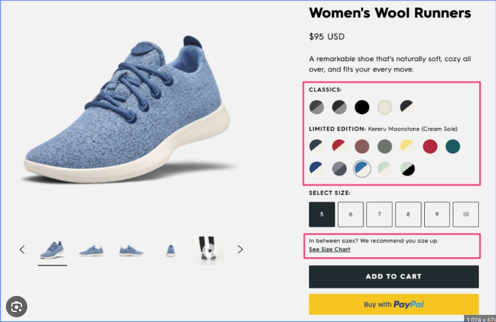

```{r setup, include=FALSE}
knitr::opts_chunk$set(echo = TRUE)
```

# Introduction
In the world of e-commerce, optimizing the conversion rate is a paramount goal. A/B testing is a powerful tool that allows businesses to experiment with changes to their websites and product pages, enabling data-driven decisions for improved conversion rate. This case study presents an A/B test conducted for an ecommerce website to enhance its conversion rate.

## Background
- Business: XYZ Electronics

- Objective: To increase the conversion rate on the product page

- Duration: June 2023

## Hypothesis
The hypothesis for this A/B test is a change in the product page will result in a higher conversion rate. The change to be tested is an alternative design of the "Checkout page with", where the original design will be compared against the new design

The original checkout design without the paypal button

The new design to be tested with the paypal button


## Test Duration
The test would last for more between 2 weeks to 4 weeks, during the month of January 2017.

# Data Understanding

## Data Collection/ Sourcing
The data was saved on a database, to be queried and imported into R.
**Importing the required libraries**
```{r load libraries}
# For connecting to PostgreSQL database
library(RPostgreSQL)

# For data manipulation and visualization
library(tidyverse)

# advanced themes for ggplot visualization
library(ggthemes)
```
**Connecting to the Database**
```{r}
# Load Database Driver
drv <- dbDriver("PostgreSQL") #PostgreSQL Driver loaded

# Inserting PostgreSQL Credentials
conn <- dbConnect(drv,
                 dbname = "postgres",
                 host = "localhost",
                 port = "5432",
                 password = "******",
                 user = "postgres")
```

Next, we return a list of all the tables in the database so we can get the tables we will be needing for the test
```{r list_of_tables}
dbListTables(conn)
```

Query database to collect required data and preview the tables
```{r load_required_tables}
# load the tables
ab_data <- as_tibble(dbGetQuery(conn, "SELECT * FROM ab_data"))
countries <- as_tibble(dbGetQuery(conn, "SELECT * FROM countries"))

# preview the tables
head(ab_data)
head(countries)
```

## Data Structure and Data Manipulation
First we get the structure of both tables.
```{r}
str(ab_data)
str(countries)
```
The data frame ab_data is having `r dim(ab_data)[1]` rows and `r dim(ab_data)[2]` columns, while the countries data frame is having `r dim(countries)[1]` rows and `r dim(countries)[2]`` columns. Both data are related by user_id variable.


```{r}
# join the data
ab_data_combined <- ab_data %>%
  left_join(countries, by = "user_id")
```

## Data Definition
- **user_id**: the unique identifier for each visitor in the dataset.

- **timestamp**: the date and time the user enter the page

- **group**: category of the experiment to which users belong to.

- **landing page**: old or new page used for the analysis.

- **country**: the geographical location of the user.

## Variables
- Treatment indicators: landing page, group

- Response indicator: converted


```{r pressure, echo=FALSE}

```